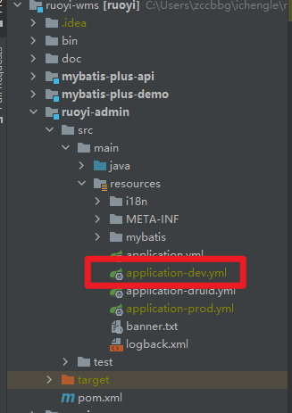
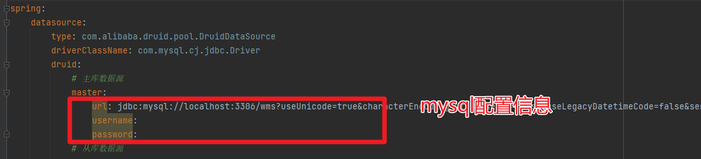
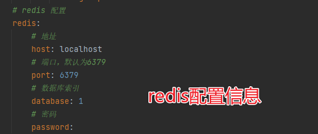
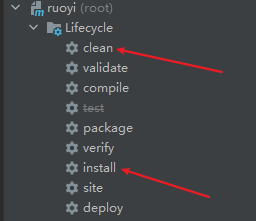
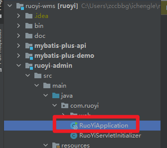

## 若依wms简介
若依wms是一套基于若依的wms仓库管理系统，支持lodop和网页打印入库单、出库单。毫无保留给个人及企业免费使用。
* 前端采用Vue、Element UI（ant design 正在开发中）。
* 后端采用Spring Boot、Spring Security、Redis & Jwt。
* 权限认证使用Jwt，支持多终端认证系统。
* 支持加载动态权限菜单，多方式轻松权限控制。
* 高效率开发，使用代码生成器可以一键生成前后端代码。
## 代码自动生成
修改application.yml文件中的backPath和frontPath路径。
backPath为后端项目路径
frontPath为前端项目路径

## 前端项目地址
### gitee
https://gitee.com/zccbbg/ruo-yi-wms-vue
### github
https://github.com/zccbbg/RuoYi-WMS-VUE

## 在线体验
- 演示地址：http://wms.ichengle.top
- 陆陆续续收到一些打赏，为了更好的体验已用于演示服务器升级。谢谢各位小伙伴。

## CSDN若依技术专栏
- 常见问题：https://blog.csdn.net/qq_27575627/category_12336113.html
- 后端技术：https://blog.csdn.net/qq_27575627/category_12331868.html
- 前端技术：https://blog.csdn.net/qq_27575627/category_12331867.html
- 运维：https://blog.csdn.net/qq_27575627/category_12332546.html

## B站视频介绍
https://space.bilibili.com/2047843623

## 若依wms功能
1. 首页：库存预警与到期提醒、基础数据报表展示
2. 仓库/库区：管理维护仓库基础数据
3. 物料：管理维护物料基础数据
4. 客户/供应商/承运商：管理维护联系人基础数据
5. 入库：创建入库单后包括如下几个状态：未发货、在途（已发货未入库）、部分入库、作废、入库完成，入库类型包括：采购入库、外协入库、退货入库，入库单支持lodop和网页打印
6. 出库：创建出库单后包括如下几个状态：未发货、部分发货、已发货、作废，入库类型包括：销售出库、外协出库、调拨出库，出库单支持lodop和网页打印
7. 移库：创建移库单后包括如下几个状态：未操作、部分移动、操作完毕、作废
8. 库存看板：查看当前物料库存数量
9. 库存记录：查看当前物料库存操作记录
10. 库存盘点：已完成
11. 库存月结：todo
12. 各类报表: todo
## 状态流转
#### 入库状态流转

#### 出库状态流转

## 演示图

## 本地安装
### 基本环境
1、JDK：8+
2、Redis 3.0+
3、Maven 3.0+
4、MYSQL 5.7+
5、Node v8+

### 后台系统工程（JAVA端）
1. 导入数据库，配置开发环境数据库信息及其redis信息，我设置了git ignore，请自行创建application-dev.yml文件，文件路径如下：  

2. 在父级pom.xml输入命令 mvn clean install 或者用idea工具操作  

3. 启动程序，启动程序路径如下  

## 关于我们
* 开发团队成立5年，我们前端开发、后端架构，有一颗热爱开源的心，致力于打造企业级的通用产品设计UI体系让项目 或者更直观，更高效、更简单，未来将持续关注UI交互，持续推出高质量的交互产品。
* 这五年我主要做isv对接淘宝、拼多多、抖音、美团等平台的订单处理应用，日处理订单300w条，因为要熟悉业务也开过淘宝和拼多多店铺运营了一个网易严选的品牌。我们的公众号会陆续更新一些我一边撸代码一边做客服的经历。也会更新一些我的读书笔记以及编程、创业、生活中踩坑的文章。另外还会开放一些米哈游、博世、企查查、同程、阿里、京东、拼多多等大厂、中厂或外企的内推岗位！
* 交流合作可加微信：zccbbg

## 交流群
群主一直关注着群内消息，受时间限制过于简单的问题群主不会进行回复，但会有热心群友回答
|  QQ群：                           |
|:------------------------------------------------------------------------------------------------------:|
|  | 

|              微信群： 关注公众号，回复：加群              |
|:------------------------------------------:|
|  | 

## 大厂、外企内推
关注“字节叔叔”公众号：每月记录一篇编程、创业、生活中踩坑的文章，陆续会开放一些微软、阿里、京东、拼多多等大厂或外企的内推岗位！
