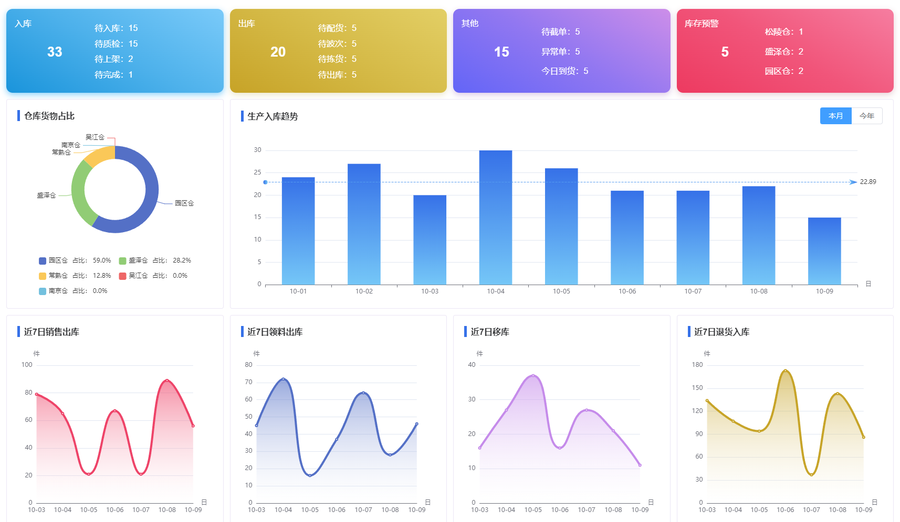
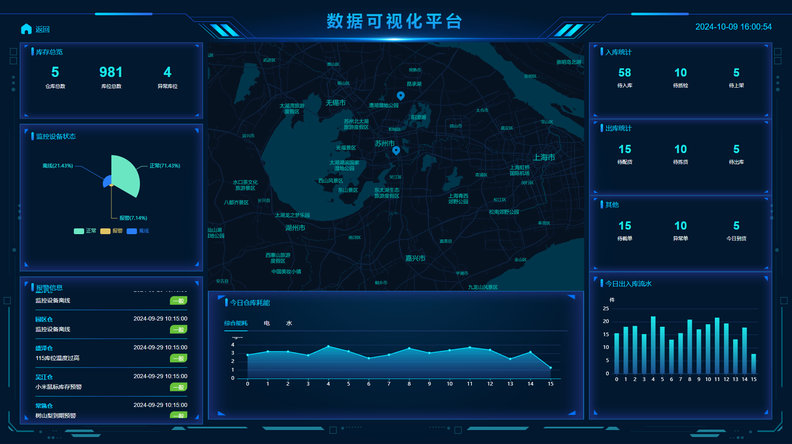
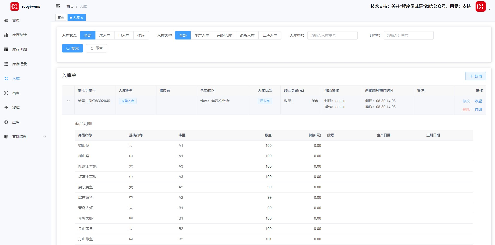
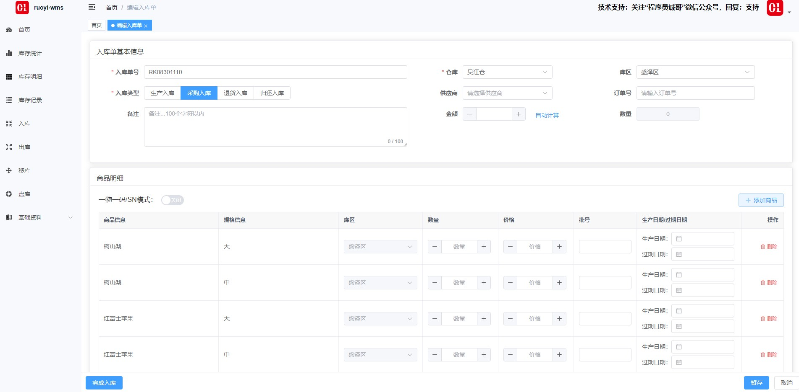
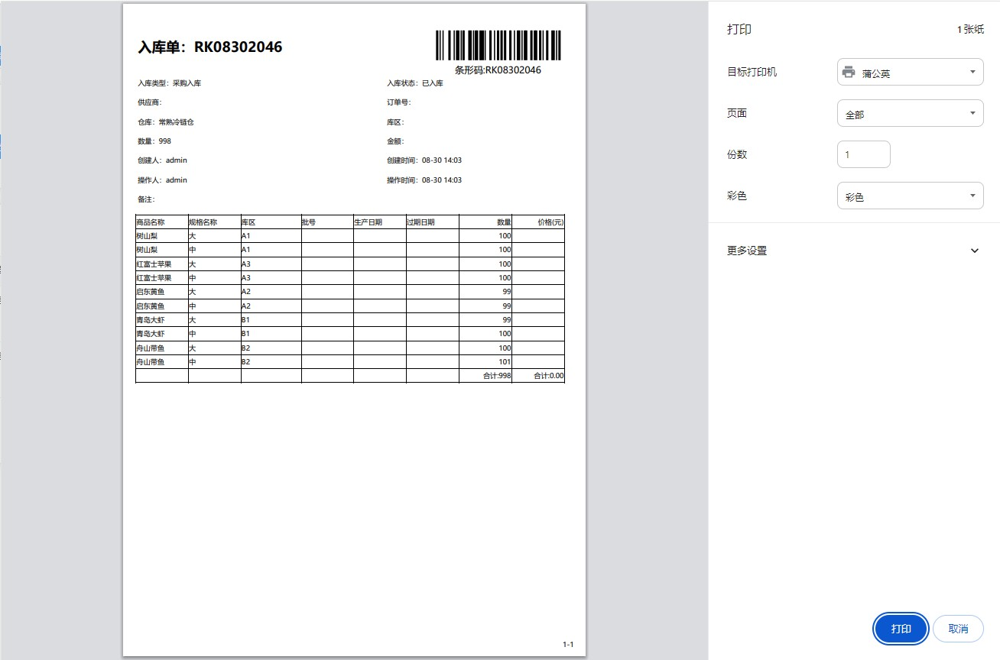
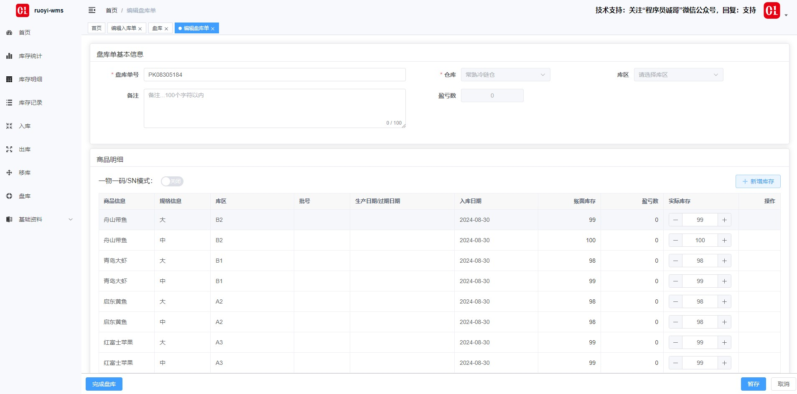
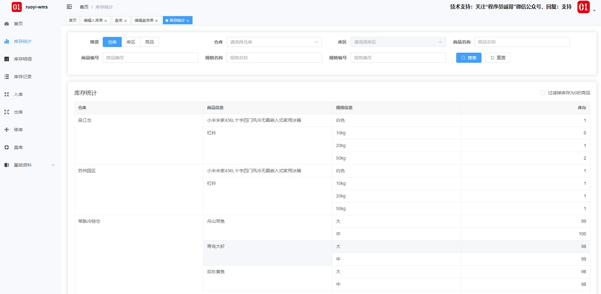
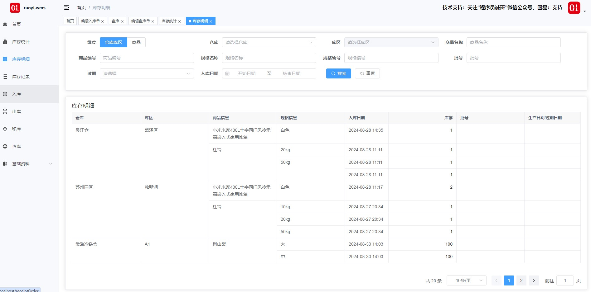
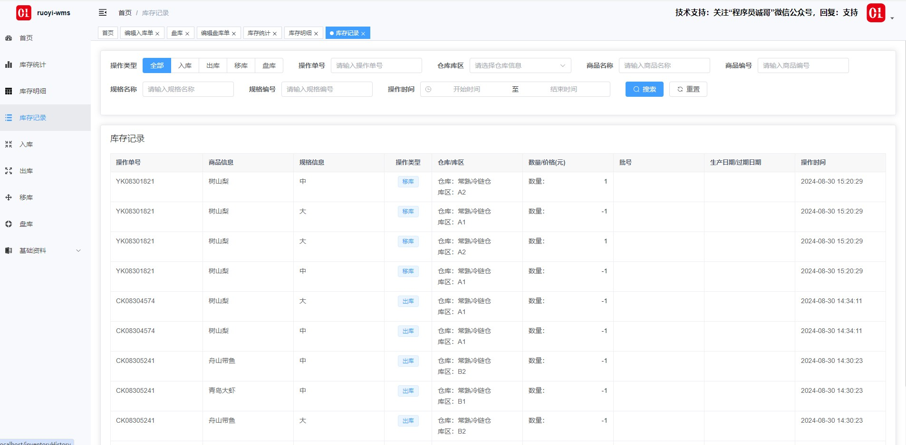

## 平台简介

> 本项目基于ruoyi-vue-fast实现

> 项目代码、文档 均开源免费可商用 遵循开源协议在项目中保留开源协议文件即可 
活到老写到老 为兴趣而开源 为学习而开源 为让大家真正可以学到技术而开源

若依wms是一套基于若依的wms仓库管理系统，支持lodop和网页打印入库单、出库单。毫无保留给个人及企业免费使用。
* 前端采用Vue、Element UI。
* 后端采用Spring Boot、Spring Security、Redis & Jwt。
* 权限认证使用Jwt，支持多终端认证系统。
* 支持加载动态权限菜单，多方式轻松权限控制。
* 高效率开发，使用代码生成器可以一键生成前后端代码。

## 前端项目地址
#### gitee
[https://gitee.com/zccbbg/ruo-yi-wms-vue](https://gitee.com/zccbbg/ruo-yi-wms-vue)

#### github
[https://github.com/zccbbg/RuoYi-WMS-VUE](https://github.com/zccbbg/RuoYi-WMS-VUE)

## 若依实战技术专栏
关注文末公众号回复：星球

## 在线体验
- 最近版V2 Lite演示地址：http://cangku.ichengle.top/
- 最新版V2 Advance演示地址：http://kucun.ichengle.top
- 旧版V1演示地址：http://wms.ichengle.top

## 不同分支介绍
`lite` jdk17+vue3，支持多仓库，没有库区概念，操作简单，覆盖大部分库存应用场景。

`advance` jdk17+vue3，支持多仓库、多库区，记录生产日期、过期日期、sn，可适配一物一码，操作相对复杂。

`v1` jdk8+vue2

`master` 同步lite分支

## 若依wms功能
1. 首页：库存预警与到期提醒、基础数据报表展示
2. 仓库/库区：管理维护仓库基础数据
3. 物料：管理维护物料基础数据
4. 客户/供应商：管理维护联系人基础数据
5. 入库：创建入库单后包括如下几个状态：暂存、作废、完成入库，入库类型包括：采购入库、外协入库、退货入库，入库单支持网页打印
6. 出库：创建出库单后包括如下几个状态：暂存、作废、完成出库，入库类型包括：销售出库、外协出库、调拨出库，出库单支持网页打印
7. 移库：创建移库单后包括如下几个状态：暂存、作废、完成移库
8. 盘库：创建盘库单后包括如下几个状态：暂存、作废、完成盘库 
9. 库存看板：查看当前物料库存数量，分仓库、库区、商品三个维度
10. 库存记录：查看当前物料库存操作记录
11. 库存明细：存放明细，分：仓库库区、商品两个维度

## 更新记录
> 参考：[UpdateHistory.md](docs/UpdateHistory.md)

## 提交issue和PR
> 提交issue前请先阅读：[ISSUE_TEMPLATE.zh-CN.md](docs/ISSUE_TEMPLATE.zh-CN.md)
> 
> 提交PR前请先阅读：[PULL_REQUEST_TEMPLATE.zh-CN.md](docs/PULL_REQUEST_TEMPLATE.zh-CN.md)

## 本地运行
https://docs.ichengle.top/wms/open/run2.html
## 系统部署文档
https://docs.ichengle.top/wms/open/ops2.html

## 演示图

## 贡献代码

欢迎各路英雄豪杰 `PR` 代码 请提交到 `dev` 开发分支 统一测试发版

## 关于我们
开发团队成立于2017年，我们前端开发、后端架构，有一颗热爱开源的心，致力于打造企业级的通用产品设计UI体系让项目 或者更直观，更高效、更简单，未来将持续关注UI交互，持续推出高质量的交互产品。

## 加群/技术支持

|                  公众号                   |
|:--------------------------------------:|
|  |
扫公众号二维码，关注后回复：“加群”或“支持”